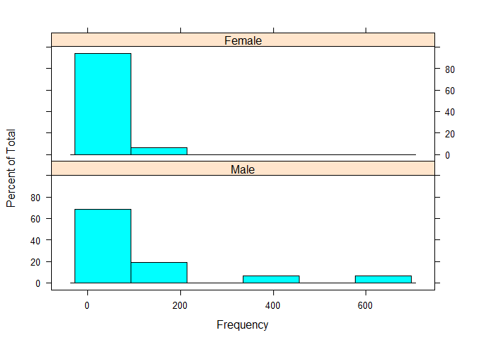
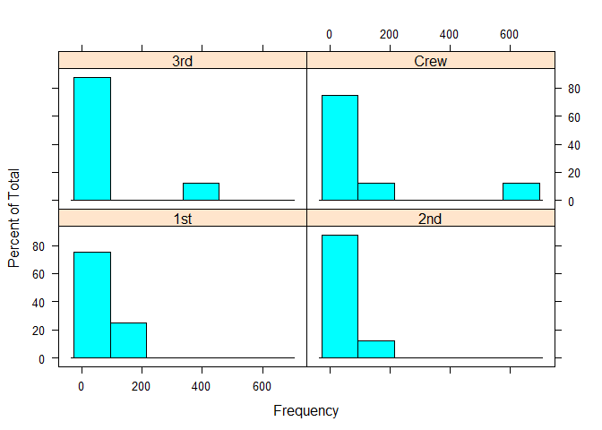

Advanced Statistics - Final Project
================

The objective of this final project is to conduct statistical analysis on a dataset of my choosing in order to gather useful and accurate conclusions. For this assignment, I will be using the dataset in R called "Titanic" which gives data on who did and did not survive the Titanic sinking in 1912. The dataset contains 32 observations of 5 variables including what class a passenger was in, their sex, age, and whether or not they survived.

``` r
df = as.data.frame(Titanic)
head(df)
```

      Class    Sex   Age Survived Freq
    1   1st   Male Child       No    0
    2   2nd   Male Child       No    0
    3   3rd   Male Child       No   35
    4  Crew   Male Child       No    0
    5   1st Female Child       No    0
    6   2nd Female Child       No    0

The way I will be analyzing this data is by conducting different hypothesis tests in order to determine if there is indeed a relationship between 2 or more variables in this dataset.

As it is a fairly straightforward place to start, I would first like to test whether or not the age of the individual had an impact on their survival rate between adults and children. To do this I will need to first create a hypothesis test and conduct a t-test in order to determine if the findings are statistically significant. Our null hypothesis for this experiment will be: "There is no relationship between the age of the passenger and whether or not they survived." Which leaves our alternative hypothesis to the opposite. For this testing, I will be using a .05 significance level.

``` r
t.test(df$Freq~df$Age)
```


        Welch Two Sample t-test

    data:  df$Freq by df$Age
    t = -2.8608, df = 15.097, p-value = 0.01184
    alternative hypothesis: true difference in means is not equal to 0
    95 percent confidence interval:
     -216.2272  -31.6478
    sample estimates:
    mean in group Child mean in group Adult 
                 6.8125            130.7500 

From our conducted t-test concerning age of the passenger with whether or not they survived, we can see that we have gathered a various number of results. First and most notably, we can see that our t statistic is -2.86. This indicates a strong opposition to the null hypothesis. This is also evidenced by a small p-value of .0118. With these findings from our t-test, we are able to now conclude that there is a relationship between the age of the passenger and whether or not they survived. I have also created a quick graph illustrating the percentage of survival between adults and children.

``` r
library(lattice)
histogram(~df$Freq | df$Age, layout=c(1,2), xlab = "Frequency")
```


Since we now know if age had a factor on survival rate, I would next like to find out if the sex of the passenger influenced their survival rate. For this testing, I will use a null hypothesis of "passenger sex has no relationship with survival rate."

``` r
t.test(df$Freq ~ df$Sex)
```


        Welch Two Sample t-test

    data:  df$Freq by df$Sex
    t = 1.6873, df = 16.635, p-value = 0.1102
    alternative hypothesis: true difference in means is not equal to 0
    95 percent confidence interval:
     -19.90316 177.52816
    sample estimates:
      mean in group Male mean in group Female 
                108.1875              29.3750 

We can see from these findings that while our t-statistic of 1.69 is still higher than zero and our p-value of 0.1102 is quite small, the numbers are not significant enough to reject our null hypothesis. While there may be some relationship between sex and survival rate, it is not definitive enough to make any concrete conclusions.

``` r
histogram(~df$Freq | df$Sex, layout=c(1,2), xlab = "Frequency")
```



Looking at the graph we can see that while it is similar to our first graph, the comparitive distributions are too similar to make any conclusions.

Lastly I am curious whether or not the class of the individual had any say in whether or not they survived. For this test I will be comparing the class (1st, 2nd, 3rd and the crew themselves) to survival rate. However since we have more than 2 levels for our classes, we cannot conduct a t-test. Instead, we will be conducting a linear regression test and find our f-statistic as well as p-value.

``` r
lmtest <- lm(df$Freq ~ df$Class - 1)
summary(lmtest)
```


    Call:
    lm(formula = df$Freq ~ df$Class - 1)

    Residuals:
        Min      1Q  Median      3Q     Max 
    -110.62  -72.00  -35.62    4.66  559.38 

    Coefficients:
                 Estimate Std. Error t value Pr(>|t|)  
    df$Class1st     40.62      49.15   0.827   0.4155  
    df$Class2nd     35.62      49.15   0.725   0.4746  
    df$Class3rd     88.25      49.15   1.795   0.0834 .
    df$ClassCrew   110.62      49.15   2.251   0.0324 *
    ---
    Signif. codes:  0 '***' 0.001 '**' 0.01 '*' 0.05 '.' 0.1 ' ' 1

    Residual standard error: 139 on 28 degrees of freedom
    Multiple R-squared:  0.2533,    Adjusted R-squared:  0.1466 
    F-statistic: 2.374 on 4 and 28 DF,  p-value: 0.07617

Through this test we can see a number of results. Most notably we will be looking at the separate p-values obtained as well as the final collective p-value. For 1st and 2nd class passengers, the p-value is much too high for there to be any significant relationship between survival rate. We can also say the same for 2nd class passengers as the p-value is also too high for there to be any relationship. For 3rd class passengers, however, we see that the p-value is quite small, however for a significance value of .05, it is still too large to have any concrete evidence of a relationship. Lastly, we see that crew-members have a p-value that is the smallest at .0324. This indicates that there was indeed a relationship between crew-members and rate of survival. While this may be though, our collective p-value of .0761 indicated that there is no significant relationship between passenger class and survival rate and is further evidenced by our f-score of 2.374.

``` r
histogram(~df$Freq | df$Class, xlab = "Frequency")
```



And lastly here is a graph depicting the relationship or lack of between class and survival rate.

From this analysis we can see that there were indeed some correlations between who you were and how likely you were to survive the Titanic crash. Most notably we saw that adults were much more likely to survive than children, as well as crew-members were much more likely to survive than passengers. While not all of this data was deemed significant enough to hold a correlation, it was useful to analyze and see what relationships were present.
